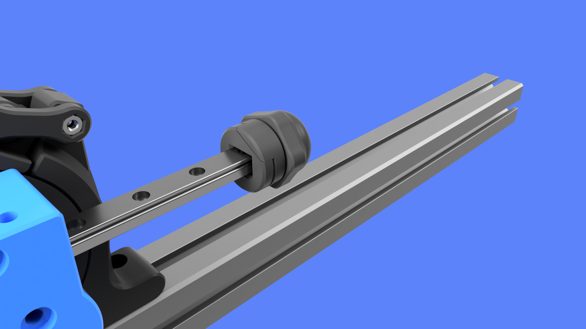
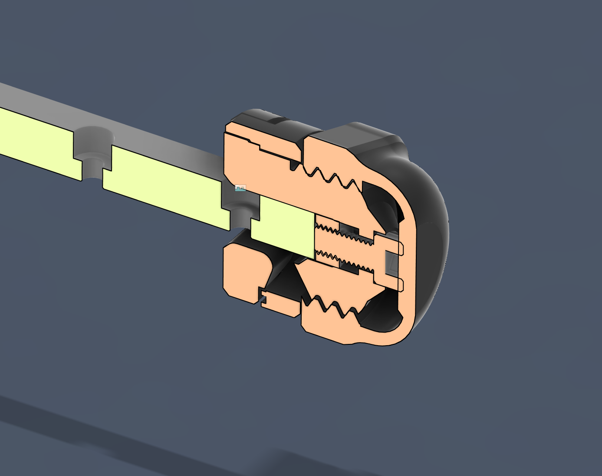
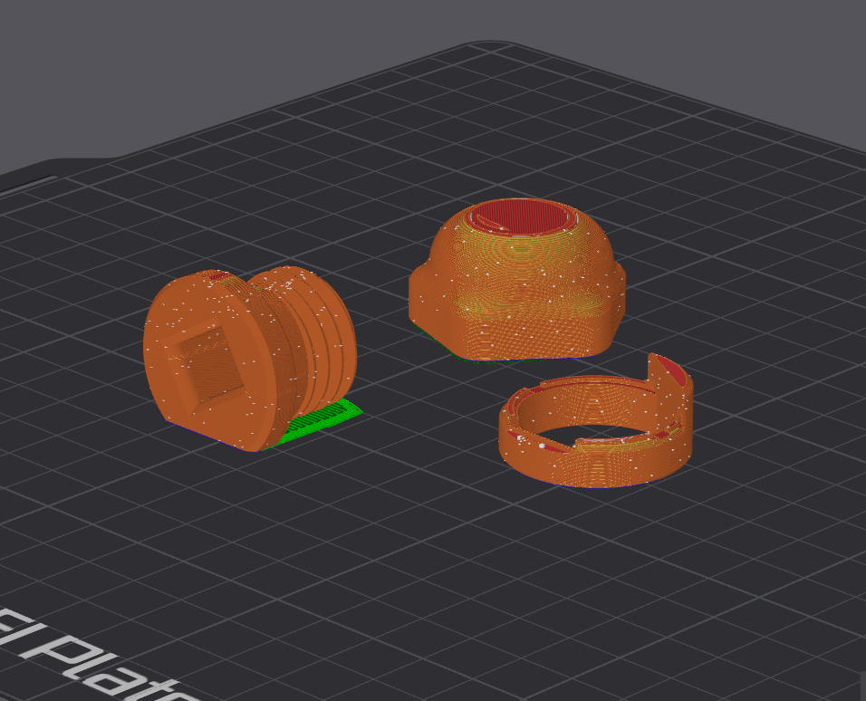

## Screwcap Mini Tensioner

**Summary**  
This is a compact belt tensioner that supports up to 12mm belts.  
Smooth-styling, no exposed hardware. Safer for accidental contact.  

**Hardware**  
M5x10 Socket Cap Head Bolt  
M5 Nut

**Printing**  
Recommended profile: Strength, 20% infill

Screwcap_Mini_Tensioner_Ring - No supports  
Screwcap_Mini_Tensioner_Cap - Supports necessary, just needs to hold up the middle  
Screwcap_Mini_Tensioner_Base - Print on a small raft, I used 2 layer raft

For best results, print using "Variable layer height" for Screwcap_Mini_Tensioner_Base and Screwcap_Mini_Tensioner_Cap. It's really worth the extra time here.

**Assembly**  
Drop nut into the Base. Screw in the bolt lightly from the other side until the nut is secured into the base of the hole.  
Loosen the bolt unil there is small gap visible between it and the Base  
Slide belt through Base opening, slide base onto rail  
Pull tension on the belt while sliding the Ring into place  
While keeping tension on the belt, screw on the cap.

You should feel the cap hit the head of the screw, and as you tighten from there it will move the tensioner away from the rail while also tightening it's grip on the belt. Unscrew and adjust the bolt position and repeat the process if you need to vary the tension.

**Attributions**  
Inspired by Jack's 24mm effector + tensioner  
Inspired by JRG's clampring tidy-up