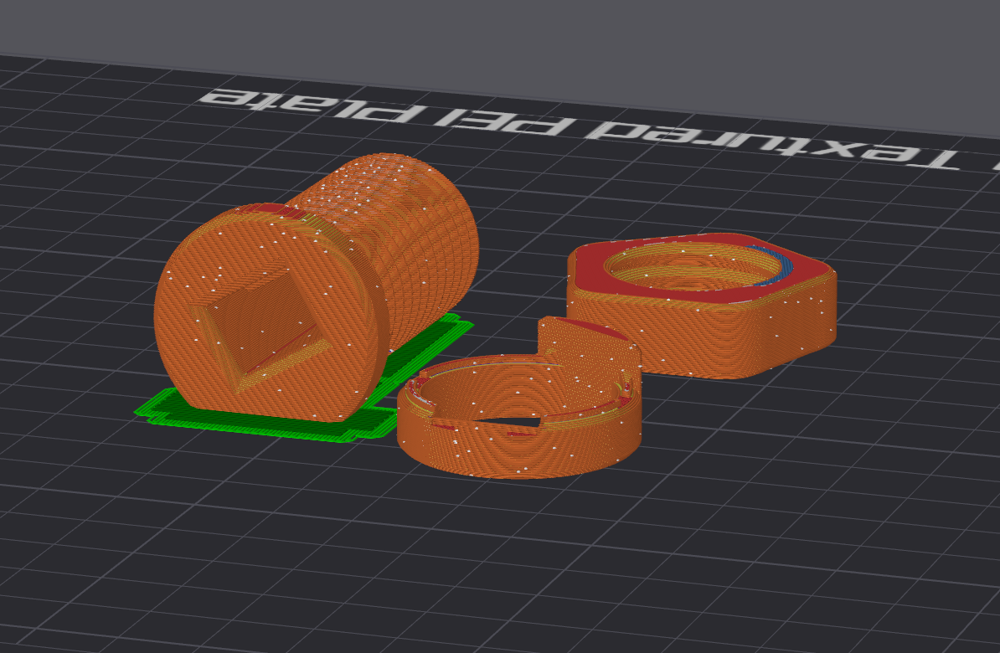

## Multipurpose End Effector Tensioner

Inspired by Jack's 24mm effector + tensioner  
Inspired by JRG's clampring tidy-up

**Notes**  
Multipurpose_End_Effector_Tensioner_Medium is the end I would recommend.   
Multipurpose_End_Effector_Tensioner_Short will give you 25mm additional travel but should be reserved for non-heavy-duty applications  

**Summary**  
//TODO

**Hardware**  
//TODO

**Printing**  
Use a 2 layer raft under the threads for better adhesion  

**Assembly**  
//TODO