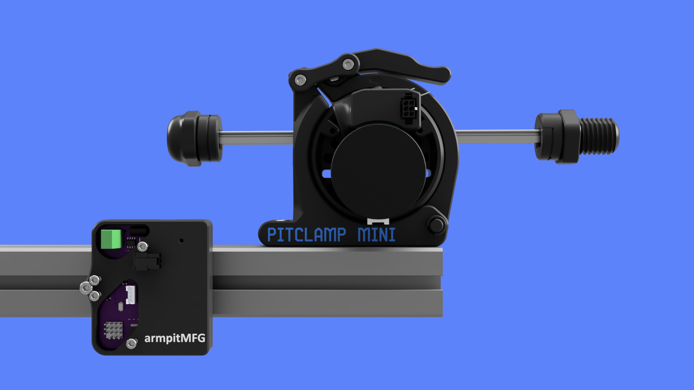
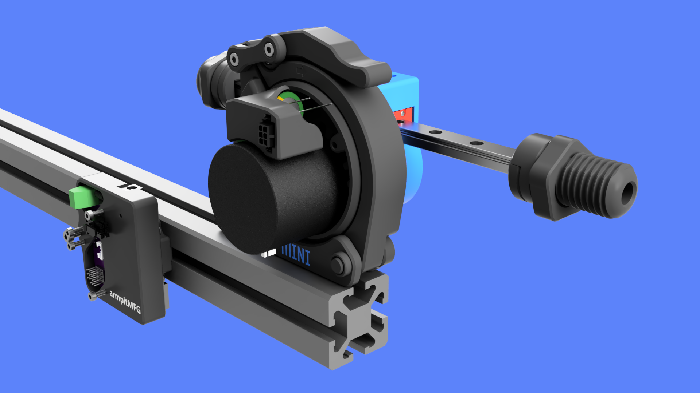
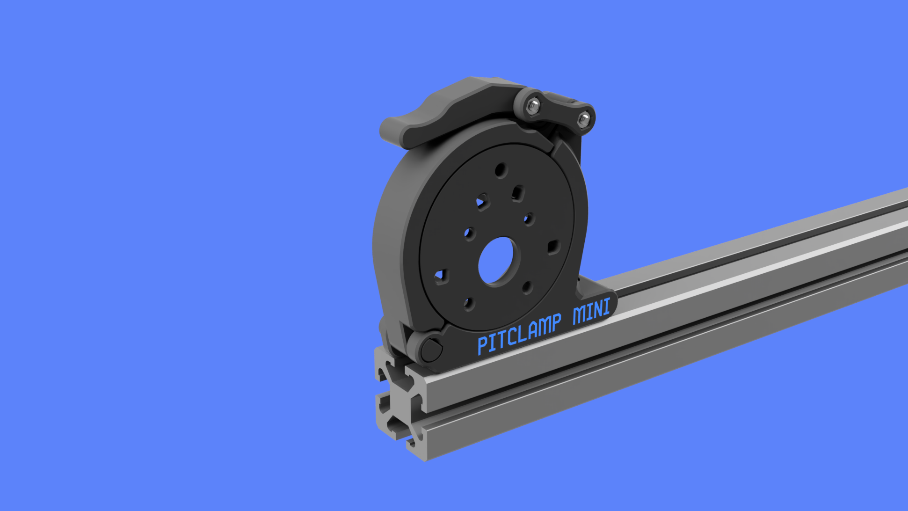
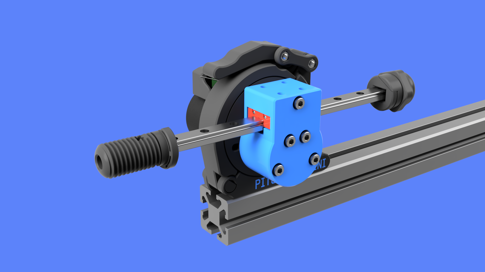
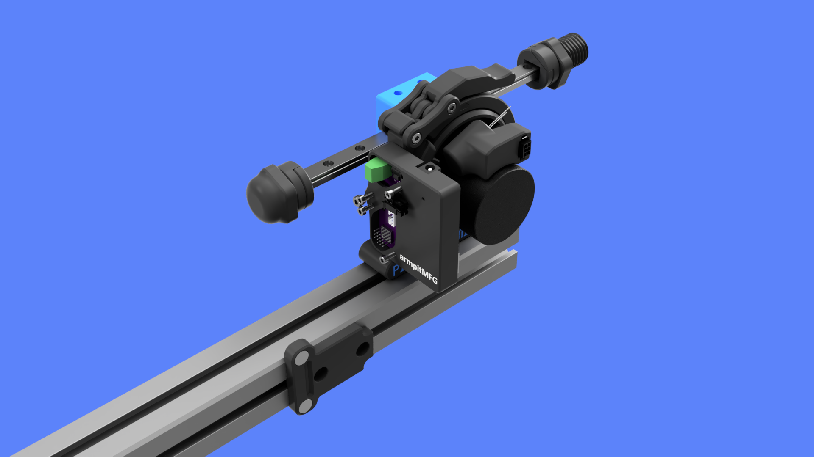
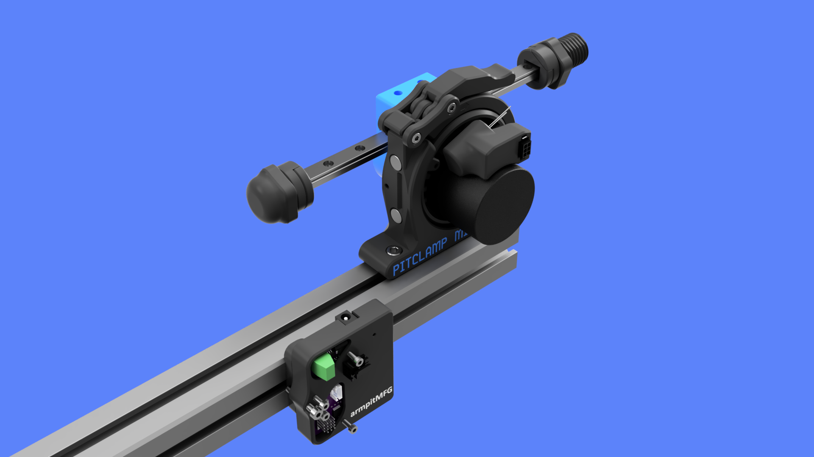

# PitClamp Mini
**NOTE**  
_This is currently pre-release W.I.P._  
_I am releasing select files along the way that can be used for other projects_  

## Summary    
Secure mounting and easy rotational adjustment of 42AIM, 57AIM, iHSV57, NEMA23 closed loop servo motor form factors.  
Primary application is for thrusting sex machine (OSSM - Open Source Sex Machine)

## Features  
  - Motor can be completely removed from mount    
  - Selection of bases for different use cases
    - 4040 or 3030 Extrusion
    - Tabletop compact clamp
    - Experimental TBD
  - Relocatable OSSM Reference Board v2  
  - (Optional) Capacitor located on motor for solder-less pre-v2.3 board compatability  
  - 4 degree rotational granularity
    
## Roadmap  
**Motor Rings:**
  - 42AIM Motor Ring: 95%  
  - 57AIM Motor Ring: 25%
  - iHSV57 Motor Ring: 25%

**Clamping Components:**
  - Upper Clamp: 95%  
  - Lower Clamp 4040 Base: 90%  
  - Lower Clamp Tabletop Base: 0%
  - Lower Clamp Experimental Base: 10%
  - Handle: 80%  
  - Dogbones: 95%  
  - Hinge Pin: 95%

**Relocatable Reference Board:**
  - Reference Board Case: 75%  
  - Reference Board 4040 Bracket: 90%
  - 42AIM/57AIM Motor Plug Tidy w/ Capacitor: 75%
  - 42AIM/57AIM Motor Plug Tidy w/o Capacitor: 50%

**Motor Head:**
  - TBD, current plan is to use 3rd party head design

**Rail Components:**
  - Screwcap Mini Tensioner: 95%
  - Mini End Effector: 95%
  - XL End Effector: 95%

## Changes from PitClamp v3 
  - Support added for 42AIM motor  
  - Motor ring diameter reduced by 15%  
  - Overall filament required reduced by 25%  
  - Clamping rotational grip strength increased  
  - Clamp "helper" added to reduce adjustment noise/clunkyness  
  - Print clarity improved (and optional-default-none) for first and last layer "PitClamp" branding  
  - Rear hinge pin is no longer a printed piece

//TODO: add more detail  

